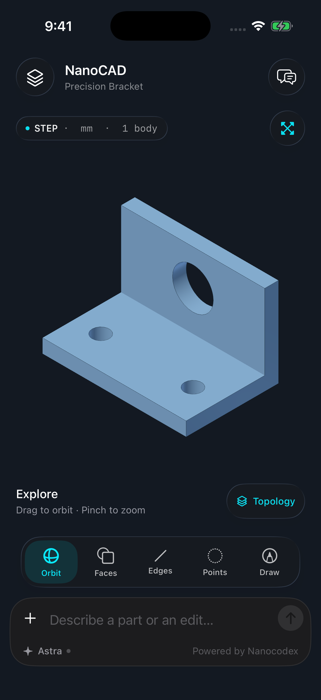
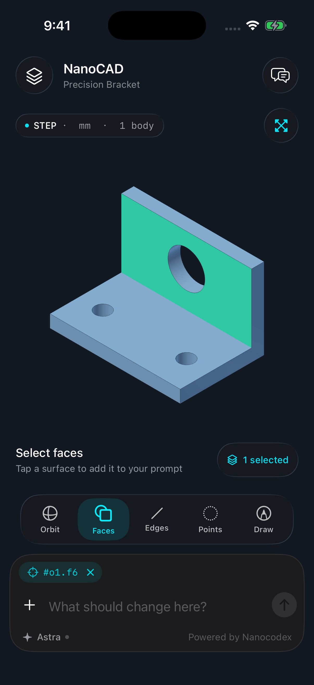
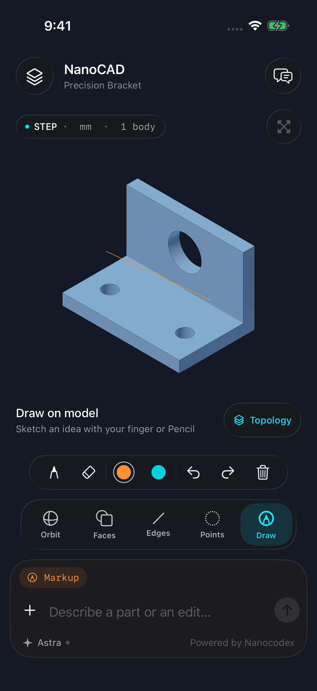

# NanoCAD

**Give your idea shape.** A native iPhone and iPad CAD workspace powered by Nanocodex and Astra.

Describe a part, inspect its real STEP geometry, tap the exact faces or edges you want to change, and sketch directly over the viewport. NanoCAD turns those selections and marks into context for your next prompt.

<p align="center">
  
  
  
</p>

## What’s here

- SwiftUI with iOS 26 Liquid Glass controls and a compact, growing Nanocodex composer.
- A native SceneKit viewport: orbit, pan, zoom, fit, face picking, edge picking, and vertex picking. No WebView.
- A topology inspector with exact face areas, edge lengths, and vertex coordinates in millimeters.
- PencilKit pen, eraser, colors, undo, redo, and clear. Markup preserves its document revision and captured view across app launches and layout changes.
- A durable Astra agent and persistent Cloudflare CAD sandbox per project. Inputs upload before submission; completed STEP files remain in the cloud.
- Plain-language progress with a tap-through conversation and expandable tool details. Projects, drafts, selections, drawings, and transcripts persist across relaunches.
- Real STEP imports and exports. A pinned CAD kernel produces native mesh previews with the same geometry references used by [earthtojake/text-to-cad](https://github.com/earthtojake/text-to-cad).
- A real, offline sample bracket, including its STEP, mesh preview, and reproducible source.

## Run on a simulator

Requires macOS, Xcode 26+, an iOS 26+ simulator, and [XcodeGen](https://github.com/yonaskolb/XcodeGen).

```sh
brew install xcodegen
xcodegen generate
open NanoCAD.xcodeproj
```

Select the **NanoCAD** scheme and an iPhone or iPad simulator, then Run. The sample, topology selection, markup, and preview imports work offline. Run the scheme’s test action for native geometry, streaming, persistence, and UI behavior tests.

For a physical device, set your development team and enable code signing in Xcode. No signing credentials are included.

## Create with Astra

Write a prompt and tap Send, or choose **Astra → Connect with Nanocodex**. NanoCAD opens the existing Nanocodex Connect dialog in a native sheet. Its normal approval includes the CAD execution capability. The scoped connection stays in this device’s Keychain; there is no separate CAD setup service. An account key remains available under Advanced connection.

Write a prompt such as:

> Create a 60 × 40 × 5 mm mounting plate with four 4 mm holes, each 6 mm from its adjacent edges.

Or select one or more faces or edges and ask:

> Round these edges with a 2 mm radius.

Each project keeps a persistent CAD specialist: a stable Connect conversation and durable agent explicitly configured with `gpt-6-astra`. The app includes text-to-cad’s pinned 0.6.6 CAD skill and all its references. The specialist maintains model source and checks across edits, uses cadgen’s warm worker/cache, and executes simple edits directly without launching a second agent. NanoCAD uploads the current STEP, exact revision, bundled exporter, and any annotated image before admitting a turn. Astra reuses that project’s Cloudflare sandbox with Python 3.12 and `cadgen==0.6.6`. The finished STEP and native preview are published as immutable files tied to that turn. The app verifies their hashes and matching geometry revision before replacing the model.

After the progress line says the job is working in the cloud, you can close NanoCAD. Returning reconnects automatically using the same saved request, turn, and event cursor. Stop explicitly cancels cloud work. An upload interrupted before submission continues when the app reopens; a request cannot run until its inputs reach the server. A failed generation can be retried with the original prompt and geometry.

Open **Projects** or swipe from the left edge to reveal the project drawer on iPhone. On iPad, projects stay in a sidebar. Each saved model has a real thumbnail; search, switch, rename, or create a project there. Switching projects preserves their jobs and drafts. While Astra works, validated intermediate revisions update the native viewport without resetting your camera. The **LIVE** badge identifies previews; the finished STEP replaces the saved model only after its final publication is verified. Tap the progress line or conversation button for the retained transcript, with tool inputs/results behind Details. Large binary transfers and credential values are omitted from the transcript; any history/content retention limit is shown explicitly.

## Import existing CAD

Use **+** or **Design menu → Open STEP or preview**. STEP/STP imports use Astra to tessellate the original geometry without remodeling it. The current cloud upload limit is 600 KB per input file. Immutable publication currently supports 1 MB per output file; the preview exporter can use coarser tessellation without changing the STEP geometry.

For larger models or offline viewing, export a preview on a computer:

```sh
python3.12 -m venv .cadgen-venv
.cadgen-venv/bin/pip install -r Tools/requirements.txt
.cadgen-venv/bin/python Tools/export_step.py part.step --out part.cad.json
```

Open `part.cad.json` in NanoCAD through Files. A preview imported by itself supports viewing, selection, and markup; editing requires its source STEP. Use **Export STEP** to share a source STEP when one is present.

## Scope and current limits

This is an initial native application, not the full desktop CAD Viewer. It supports leaf bodies and face/edge/vertex references, but not kinematic animation, engineering drawing PDFs, material editing, constraints, or on-device B-rep editing. Markup is a review of a captured camera view, not a constrained CAD sketch. Reference IDs belong to one saved STEP revision and are cleared after regeneration.

Connect uses grant-scoped uploads and per-turn artifact downloads. It cannot read arbitrary account workspace files. One active generation is supported per project. Reliable completion notifications while the app is closed are not enabled: they require APNs registration, push-enabled signing, and a server publisher. See [validation](docs/validation.md) for the tested boundary.

SceneKit provides a native renderer with Metal backing. Apple now [marks SceneKit deprecated](https://developer.apple.com/documentation/scenekit/); a future renderer can consume the same CAD document contract without changing generation or topology identity.

## Architecture and provenance

- [CAD exporter, references, geometry checks, and limits](docs/exporter.md)
- [Nanocodex API and authentication contract](docs/nanocodex-integration.md)
- [Validation and simulator evidence](docs/validation.md)
- [Third-party notices](NOTICE.md)

Inspired by and built against [earthtojake/text-to-cad](https://github.com/earthtojake/text-to-cad). Its geometry kernel and reference semantics power the CAD export pipeline. Only the composer editor is reused from Nanocodex; the rest of the mobile interface and native viewport are implemented for NanoCAD.

MIT licensed.
