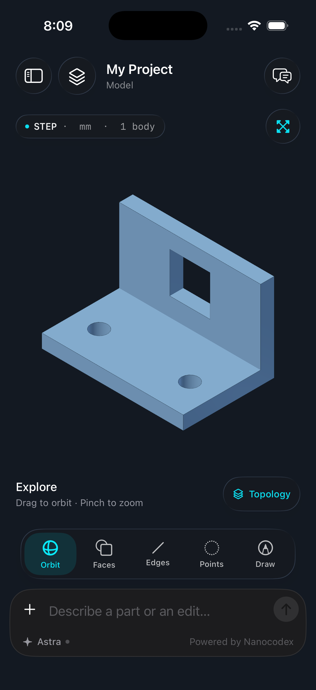

# Post-change CAD specialist validation

Only the changed workflow was measured; there is no before/after speedup claim.

In an isolated Cloudflare sandbox, the specialist changed the bundled bracket’s upright Ø24 mm hole to a 24 × 24 mm square. Saved Open CASCADE checks confirmed one valid positive-volume solid, unchanged outside dimensions and base holes, and exactly the analytically expected removed volume. The supplied native exporter produced a coherent checkpoint and final pair.

| Measured stage | Seconds |
| --- | ---: |
| Cold Python environment | 8.95 |
| Cold CAD dependencies | 18.61 |
| Maintained-source edited STEP build | 3.20 |
| Native preview and checkpoint | 6.05 |
| Saved geometry batch checks | 6.60 |
| One warm unchanged source/re-export, including status and imports | 6.83 |

These are single-run process timings, excluding model reasoning, tool scheduling and transfer. Inspection included 32.36 seconds of cold imports/cache. Two validation-helper mistakes required repair, so no total prompt-latency result is claimed. The warm source was already current; its output pair was byte-identical, and the daemon/worker processes were reused.

The complete CAD skill is pinned to text-to-cad v0.6.6. Installing its many small files on object-mounted storage was slow. The app now installs the reconstructible skill on local `/opt/nanocad/skills/cad`, retaining the uploaded bundle for recovery. Authoritative project source and final artifacts remain durable.

The generated pair was subsequently loaded as an isolated native simulator fixture. The exact STEP hash matched the preview, and the rendered snapshot was visually reviewed: the square upright opening, two circular base holes, and bracket shape match the requested edit. This is a native rendering check, not a claim of an authenticated phone import.

STEP SHA-256: `d578b1e72d105eb84875551134256c7516de5e128952014429667355d0327f9e` (44,346 bytes). Native preview: 63,356 bytes, 14 faces.

The separate cadgen snapshot attempt failed because its Chromium download was denied and its expected browser was absent. The native review above succeeded; the cadgen snapshot path remains unverified. Physical Connect evidence and its remaining close/reopen boundary are recorded in [validation](validation.md).
